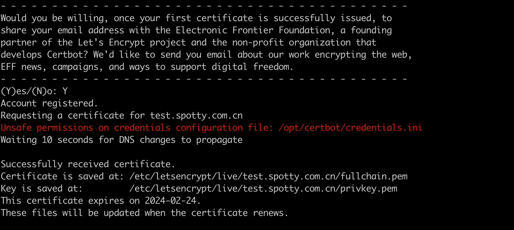

# Multi dns provider authentication plugin for certbot

[](https://github.com/warjiang/certbot-dnshub/actions/workflows/pypi.yml)
[](https://pypi.org/project/certbot-dnshub/)
[](https://pypi.org/project/certbot-dnshub/)
[](https://pypi.org/project/certbot-dnshub/)
[](https://pypi.org/project/certbot-dnshub/)


> English | [中文](README_zh-CN.md)

Multi dns provider authentication plugin for certbot. It can help you automatically apply and update Let's Encrypt wildcard certificates.

## PreRequisites
1. You already have a domain name, such as `example.com`.
2. The corresponding domain name service provider has provided openapi or sdk, such as dnspod, aliyun, tencent cloud, etc.
3. Get the configuration information(for example ak/sk or token) of openai or sdk

## Usage
you can use this plugin with docker or pip. We recommend using docker.
Take [dnspod](./assets/dnspod.md) as an example, first get the dnspod openapi configuration information, and then execute the following command:
1. Use docker container
   ```bash
   docker pull certbot/certbot
   docker run -it --rm --name certbot \
          -v /etc/letsencrypt:/etc/letsencrypt \
          -v /var/lib/letsencrypt:/var/lib/letsencrypt \
          -v `pwd`/credentials.ini:/opt/certbot/credentials.ini \
          --entrypoint /bin/sh certbot/certbot
   pip install certbot-dnshub 
   chmod 600 /opt/certbot/credentials.ini
   certbot certonly -a dnshub \
          --dnshub-credentials /path/to/credentials.ini \
          -d www.example.com 
   ```

2. Use pip
   ```bash
   python3 -m venv certbot
   source certbot/bin/activate
   pip install certbot certbot-dnshub
   chmod 600 /path/to/credentials.ini
   certbot certonly -a dnshub \
        --dnshub-credentials /path/to/credentials.ini \
        -d www.example.com 
   ```

## Supported DNS providers

| Provider | Provider Document | Usage Document | Update Time |
|---------|---------------------------------------------------------------------|----------------------------|------------|
| dnspod | [dnspod Document](https://www.dnspod.cn/docs/index.html)                  | [Usage Document](./assets/dnspod.md) | 2023-11-26 |
| aliyun     | [aliyun dns Document](https://help.aliyun.com/document_detail/29772.html) | [Usage Document](./assets/aliyun.md) | 2023-11-27 |


# FAQ
1. Unsafe permissions on credentials configuration file: /opt/certbot/credentials.ini
   
   permission of credentials.ini invalid, you can change it to 600 manually
   ```bash
   chmod 600 /path/to/credentials.ini
   ```
2. 