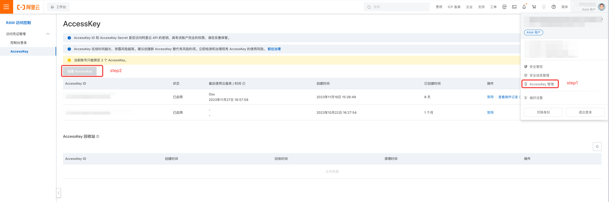
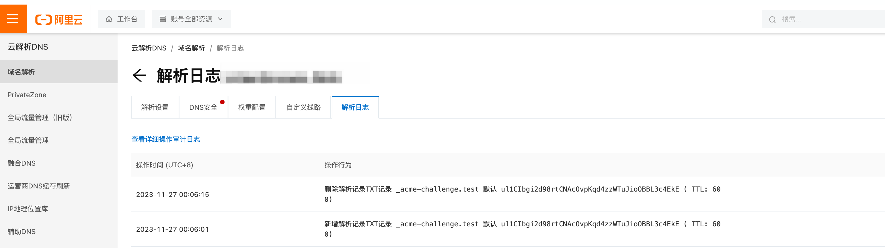

## aliyundns获取对应的accesskey信息


登录阿里云进入控制台，点击右上角的账号设置，点击AccessKey管理即可看到自己账号的AccessKey信息,如下所示

如果没有AccessKey，点击创建AccessKey创建新的AccessKey即可。


## 配置文件

创建`credentials.ini`配置文件如下所示:

```ini
dnshub_provider = aliyun
dnshub_auth_key_id = 123456
dnshub_auth_secret = 1234567890abcdef1234567890abcd
```


## 创建证书
```bash
certbot certonly -a dnshub \
    --dnshub-credentials /path/to/credentials.ini \
    -d www.example.com
```

生成证书之后能看到aliyun的dns审计日志如下：
