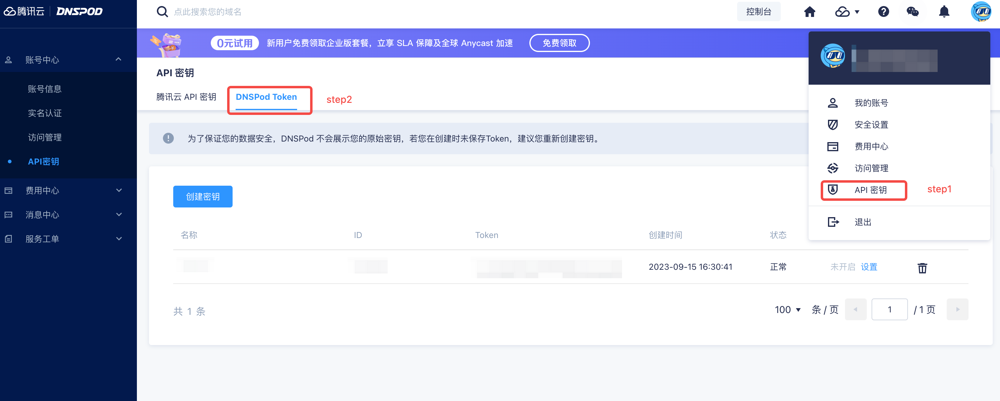

## dnspod获取对应的id/token信息

登录dnspod，进入控制台，点击右上角的账号设置，进入安全设置，点击API Token，点击创建Token，输入备注信息，点击确定，拿到id/token信息，如下所示


## 配置文件

创建`credentials.ini`配置文件如下所示:

```ini
dnshub_provider = dnspod
dnshub_api_id = 123456
dnshub_api_token = 11111111111111111111
```

## 创建证书
```bash
certbot certonly -a dnshub \
    --dnshub-credentials /path/to/credentials.ini \
    -d www.example.com
```